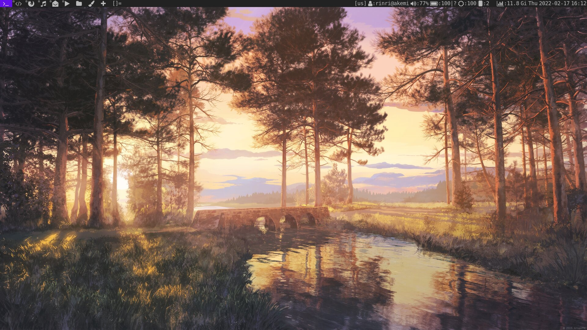
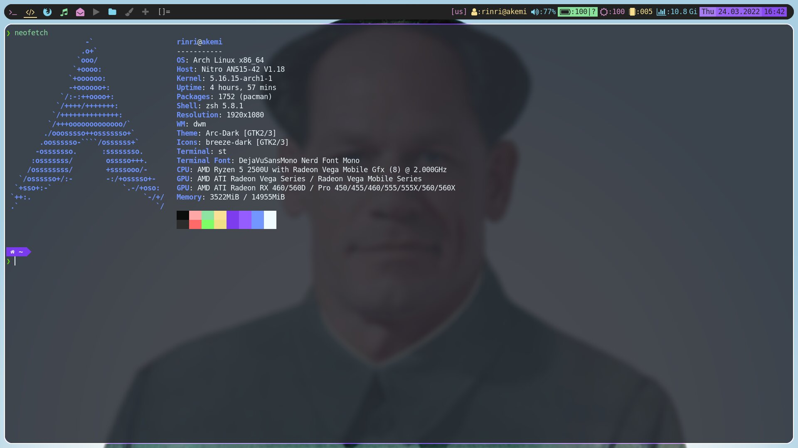
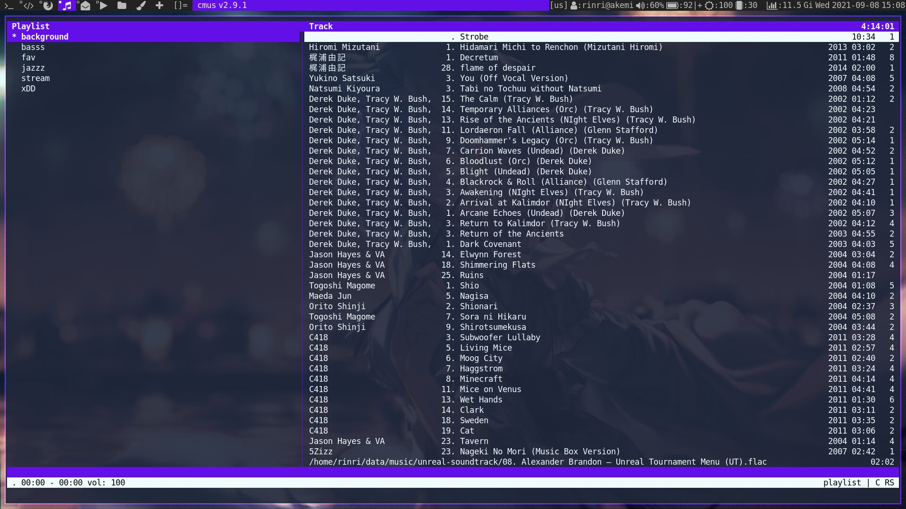
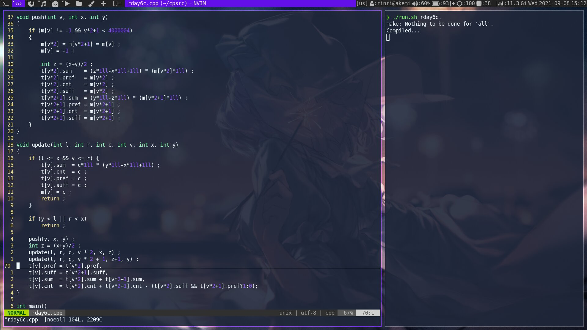
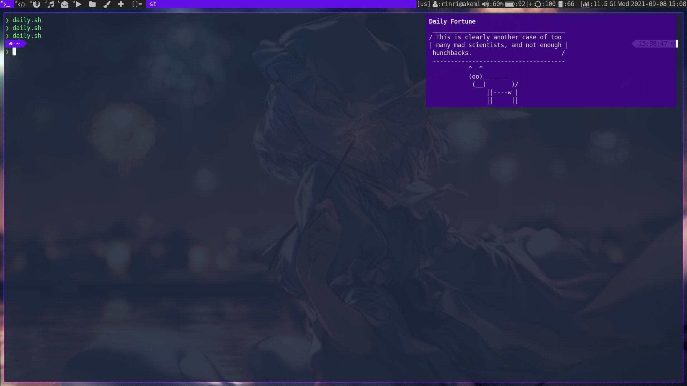
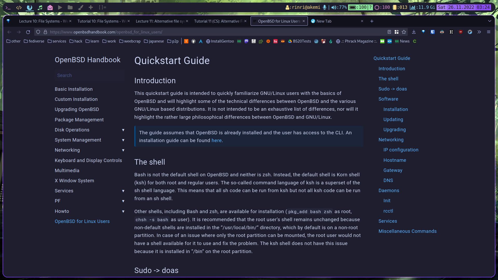

# My configuration

- OS: [Arch Linux](https://archlinux.org)
- WM: [dwm](https://dwm.suckless.org/)
- Terminal: [st](https://st.suckless.org/)
- Editor: [neovim](https://neovim.io/)
- Font: DejaVuMono Nerd Patched
- Music player: [cmus](https://github.com/cmus/cmus)
- Video player: [mpv](https://mpv.io/)
- Notifications: [Dunst](https://github.com/dunst-project/dunst)
- Status bar: [slstatus](https://tools.suckless.org/slstatus/)
- Email client: [neomutt](https://neomutt.org/) + [thunderbird](https://www.thunderbird.net)
- Wallpaper: [wallhaven](https://wallhaven.cc/w/p8q1x3) (konachan is better)

## Screenshots

### Clear:

### Neofetch:

### Music player and mixer(cmus + pulsemixer):

### Text editor(neovim):

### Notifications(dunst):

### Browser(firefox):

### Wallpaper:

