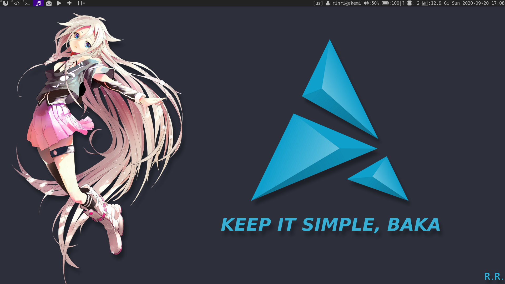
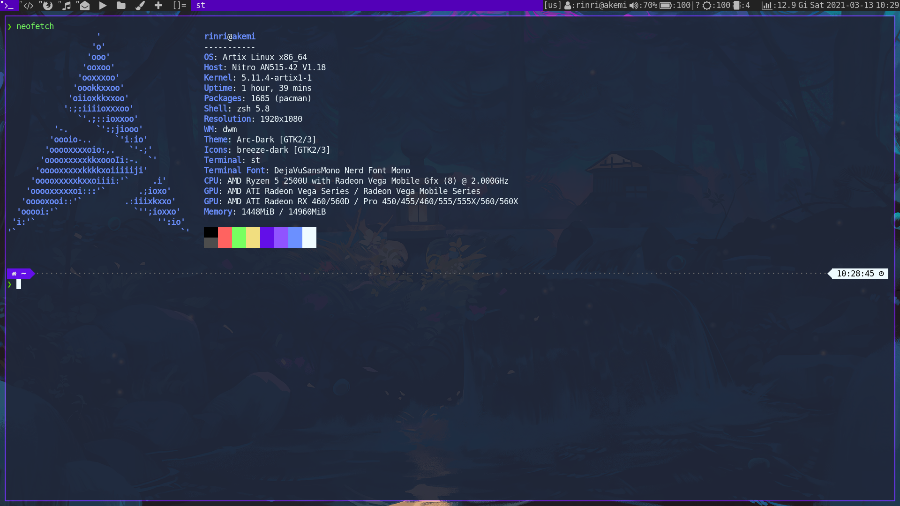
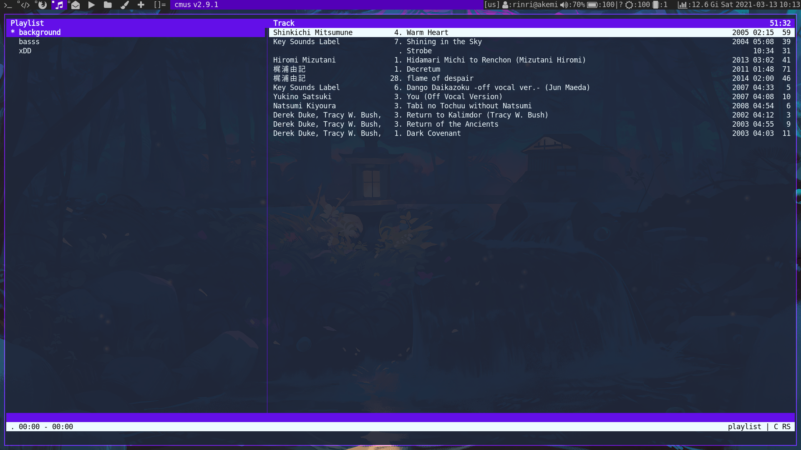
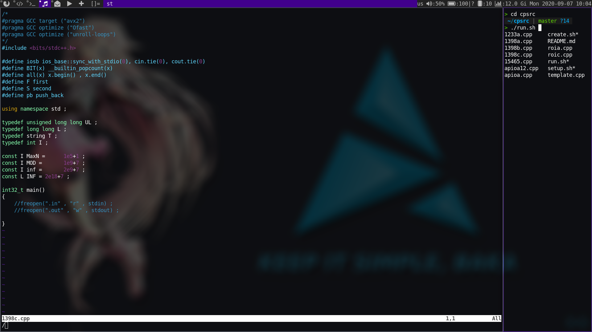
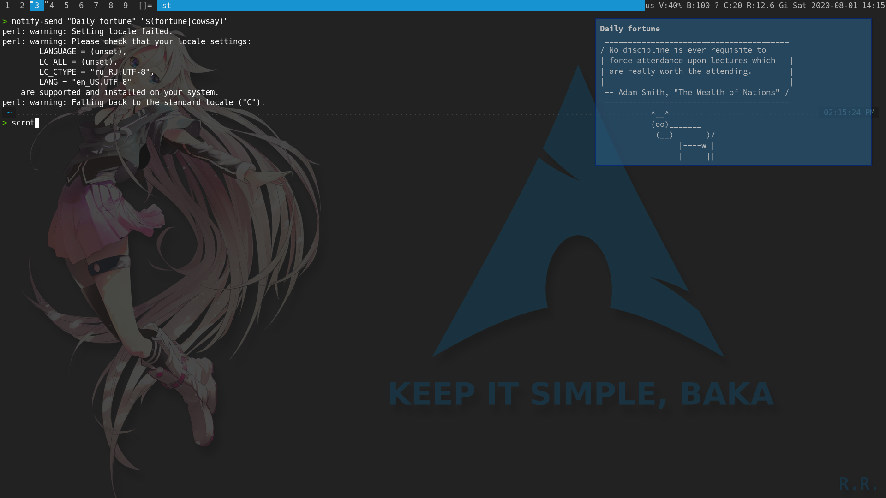
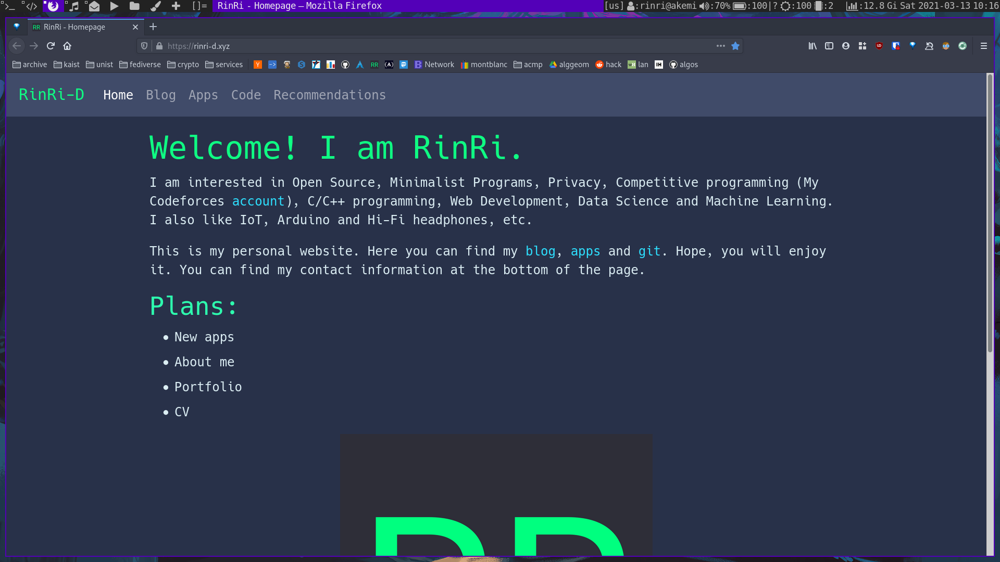
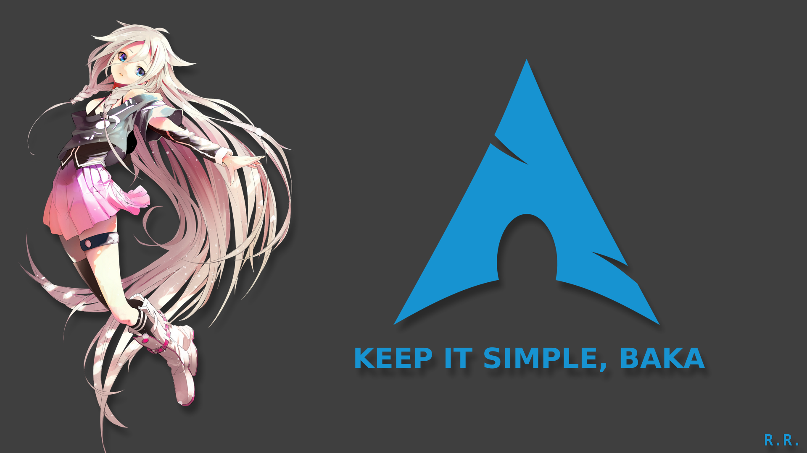

# This is my dotfiles repository

- OS: [Arch Linux](https://www.archlinux.org/)
- WM: [dwm](https://dwm.suckless.org/)
- Terminal: [st](https://st.suckless.org/)
- Editor: [neovim](https://neovim.io/)
- Font: DejaVuMono Nerd patched
- File manager: [ranger](https://github.com/ranger/ranger) (will replace it soon)
- Music player: [cmus](https://github.com/cmus/cmus)
- Video player: [mpv](https://mpv.io/)
- Notifications: [Dunst](https://github.com/dunst-project/dunst)
- Status bar: [slstatus](https://tools.suckless.org/slstatus/)
- Email client: [neomutt](https://neomutt.org/) + [thunderbird](https://www.thunderbird.net)
- News(RSS) client: [newsboat](https://newsboat.org/) + [akregator](https://userbase.kde.org/Akregator)
- Wallpaper: [pixiv](https://www.pixiv.net/en/artworks/23346358)

## Screenshots

### Clear:

### Neofetch + ranger:

### Music player with mixer(cmus + pulsemixer):

### Text editor(neovim):

### Notifications(dunst):

### Browser(firefox):

### Wallpaper(IA vocaloid):

You can find .kra file for krita and edit the wallpaper.
